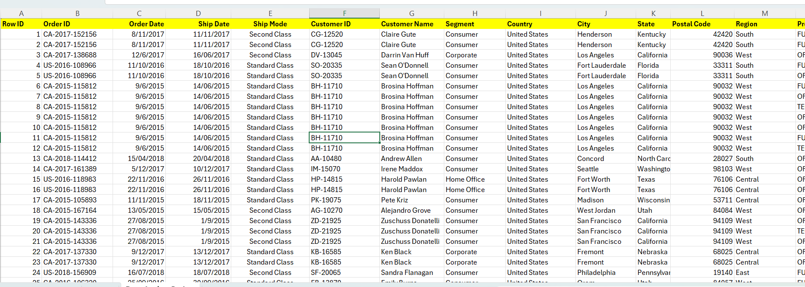

# 📊 Sales Data Analysis Dashboard (Excel)

## 📌 Project Overview
This project focuses on analyzing **sales data using Microsoft Excel** to uncover trends, performance insights. The dataset was cleaned, transformed, and analyzed using **Excel formulas, pivot tables, and charts**, then converted into an interactive dashboard.

The goal of this project is to demonstrate **data cleaning, data analysis, and data visualization skills** relevant to **Data Analyst and Business Intelligence internship roles**.

---

## 🧰 Tools & Technologies
- Microsoft Excel  
- Pivot Tables & Pivot Charts  
- Excel Functions (IF, SUMIFS, COUNTIFS, TEXT, etc.)  
- Data Cleaning Techniques  

---

## 📂 Dataset
- Sales transaction dataset  
- Key columns include:
  - Order Date  
  - Product Name  
  - Category  
  - Region  
  - Sales Amount  

*(Dataset used for academic and learning purposes)*

---

## 🔧 Data Cleaning Steps
- Removed duplicate records  
- Handled missing and inconsistent values  
- Standardized date formats  
- Created calculated columns (Month-Year)  
- Verified overall data consistency
- 

---

## 📈 Analysis Performed
- Total sales calculation  
- Monthly sales trend analysis  
- Top-selling products identification  
- Region-wise sales performance analysis  
- KPI generation for dashboard reporting  

---

## 📊 Dashboard Features
- Interactive pivot charts  
- Charts for total sales, top products, etc.
- Monthly sales trend visualization  
- Product-wise and region-wise breakdown  

---

## 🖼️ Dashboard Screenshots

### 🔹 Excel Sales Dashboard

### 🔹 Pivot Table Analysis

---

## 🎯 Key Learnings
- Practical experience in Excel-based data analysis  
- Strong understanding of pivot tables and dashboard creation  
- Ability to convert raw data into meaningful business insights  

---

